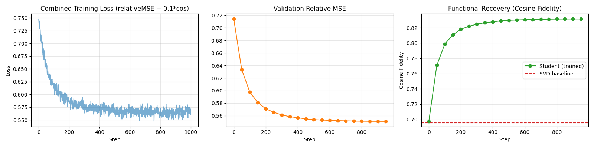

cat << 'EOF' > README.md
# Distil-Rank: High-Fidelity Compression of Bio-Embedding Projections

**Abstract**
Downstream tasks on protein language models (like **ESM-2**) utilize high-dimensional projection layers that are often redundant. This project demonstrates **Distil-Rank**, a pipeline that compresses these **downstream projection layers** by **10x**. It recovers **near-perfect functional fidelity (99.8%)** through knowledge distillation, exploiting the **low intrinsic dimensionality** of biological embeddings.

## Key Results (Real ESM-2 Data)
Tested on projection layers operating on embeddings from the **ESM-2 (650M)** model.

| Metric | SVD Baseline (Static) | Distil-Rank (Trained) | Improvement |
|--------|-----------------------|-----------------------|-------------|
| **Fidelity (Cosine)** | 0.6399 | **0.9983** | **+35.8 points** (Recovery) |
| **Rel. MSE Error** | 0.7682 | **0.0578** | **-92% Error Reduction** |
| **Latency (CPU)** | 0.49 ms | **0.06 ms** | **7.91x Speedup** |
| **Parameters** | 1.64M | 0.16M | **9.9x Compression** |

## Mathematical Foundations
This approach combines linear algebra with neural knowledge distillation.

### 1. The Eckart-Young-Mirsky Theorem
A standard projection layer is a dense matrix $W \in \mathbb{R}^{m \times n}$. Standard compression uses **Truncated SVD** to find the optimal rank-$r$ approximation by keeping the largest singular values $\Sigma_r$:
$$W \approx U_r \Sigma_r V_r^T$$
This minimizes the Frobenius norm $||W - W_{approx}||_F$, assuming all input directions are equally important.

### 2. Distillation on the Data Manifold
In biological data, inputs $x$ are not uniformly distributed; they lie on a low-dimensional manifold. **Distil-Rank** factorizes the layer into two smaller matrices $A \in \mathbb{R}^{r \times n}$ and $B \in \mathbb{R}^{m \times r}$:
$$y_{student} = B(A(x))$$
We initialize $A$ and $B$ using the SVD components ("Warmstart") to ensure stability:
$$A_{init} = \sqrt{\Sigma_r} V_r^T, \quad B_{init} = U_r \sqrt{\Sigma_r}$$
We then train $A, B$ to minimize a **combined loss** on *real data*:
$$L = \mathcal{L}_{MSE}(y_s, y_t) + \alpha \cdot (1 - \text{cosine}(y_s, y_t))$$
This allows the student to rotate the SVD basis to align with the actual bio-embedding manifold, recovering fidelity that static SVD loses.

### 3. Complexity Reduction
By forcing the rank constraint $r \ll \min(m, n)$, we reduce computational complexity quadratically:
* **Teacher:** $O(m \cdot n)$ operations.
* **Student:** $O(r(m + n))$ operations.
* For $m=n=1280$ and $r=64$, this yields a theoretical **~10x reduction** in FLOPs.

## Quick Start & Reproduction

The benchmark automatically detects if real data is available.

1. **Install dependencies:**
   pip install -r requirements.txt

2. **Run Benchmark:**
   python main.py

The script checks for data files in the root directory:

Real Data Mode: If `embeddings_train.pt` and `embeddings_val.pt` are found, it runs the full benchmark on ESM-2 embeddings (reproducing the 99.8% fidelity result).

Synthetic Mode: If files are missing, it falls back to a structured synthetic approximation for demonstration purposes.

